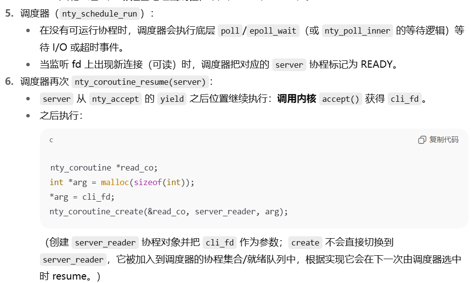

# nty_server.c

[NtyCo/sample/nty_server.c at 72ab5fd04f0c228f464f160aaa521bb791b34aa5 · wangbojing/NtyCo](https://github.com/wangbojing/NtyCo/blob/72ab5fd04f0c228f464f160aaa521bb791b34aa5/sample/nty_server.c)


## main主函数


>


>
>
>
>
>


## nty_schedule_run


## 时序图

```rust
main
  │
  ├─ nty_coroutine_create(server x100)
  │
  └─ nty_schedule_run()	// 启动调度器
       │
       ├─ resume(server)  <-- (首次 resume 会 -> nty_coroutine_init -> swapcontext -> server runs)
       │     ├─ socket/bind/listen
       │     └─ nty_accept(listen_fd)
       │           └─ nty_poll_inner(...) -> nty_coroutine_yield()  // server 挂起
       │
       ├─ 调度器 poll/epoll_wait 等待事件
       │
       ├─ 当 listen_fd 可读（新连接） -> resume(server)
       │     └─ accept() -> cli_fd
       │           └─ nty_coroutine_create(server_reader, cli_fd) // 新协程加入调度器
       │
       ├─ 之后调度器 resume(server_reader)
       │     └─ server_reader: nty_recv(fd)
       │           └─ 若阻塞 -> nty_poll_inner -> nty_coroutine_yield() (挂起)
       │
       ├─ 调度器在对应 client fd 可读时 -> resume(server_reader)
       │     └─ server_reader 继续读/写处理或关闭
       │
       └─ 调度器重复：等待 I/O / 定时器 → resume 对应协程,直到所有协程完成 / 程序退出
```

